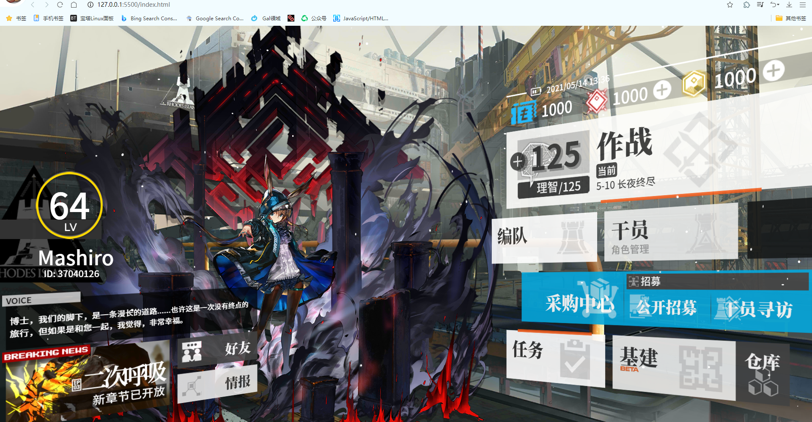

# arknights-h5
明日方舟UI H5复刻界面，基于@mashirozx的arknights-u iArknights UI：H5 + CSS 复刻明日方舟主界面修改 
[原仓库链接](https://github.com/mashirozx/arknights-ui/)

## 修改内容(￣▽￣)／
大致修改了加载界面，添加了按钮点击音效， 
语音框淡出淡入，添加语音 
修改立绘为阿米娅精二 
添加按钮点击后显示“功能正在制作 错误号-0”的弹窗 
（因为修改太多所以就不PR到原项目了qwq）
## 后续计划︿(￣︶￣)︿：
- [x] 添加语音
- [x] 语音轮播
- [x] 添加个人资料(好友)界面（未制作完成）
- [ ] 增加常用界面
- [ ] 重构加载页面
- [ ] 自定义立绘
- [ ] 一些杂七杂八的功能

## 截图
#### 主界面

#### 检测到为chrome内核的提示

#### 好友页面(未完成)

## 注意！
可能设备/浏览器分辨率不为1080x720时会有很多元素错位，（主页面没影响，就是调整窗口大小后需要刷新）
 
那是因为我移动位置的时候是使用transform的相对路径，
 
元素的大小也是使用相对路径，所以为了极致体验，
 
还请将分辨率调至1080x720
 
 
## 后言ヾ(@^▽^@)ノ
在此非常感谢@mashirozx开源的主页面qwq 
下面是原readme.md 
（本仓库一样是使用的MIT开源协议qwq） 
感谢您的支持！ 

### readme统计

 
  
 
 
# Arknights UI：H5 + CSS 复刻明日方舟主界面

## Demo
<https://mashirozx.github.io/arknights-ui/>

## IDEA
本来只是想做个人物立绘挂上一个日历做壁纸的，然后顺手把按键也做了上去，感觉这么多键位可以开发不少功能呢。

## 立绘
立绘下载：<https://share.2heng.xin/?share/folder&user=1&sid=vRtSdN3p> 提取密码: U9HIc

## TODO
切换立绘、角色台词、支持修改用户信息、游戏等级的扇形图可以用来显示温度等信息、and more...

如果你实现了新的功能，欢迎 PR！

## 版权相关
界面贴图素材都是游戏逆向出来的，仅供学习使用，请勿商用。

## License
© [Mashiro](https://github.com/mashirozx/), Released under the [MIT](https://github.com/mashirozx/arknights-ui/blob/master/LICENSE) License.
